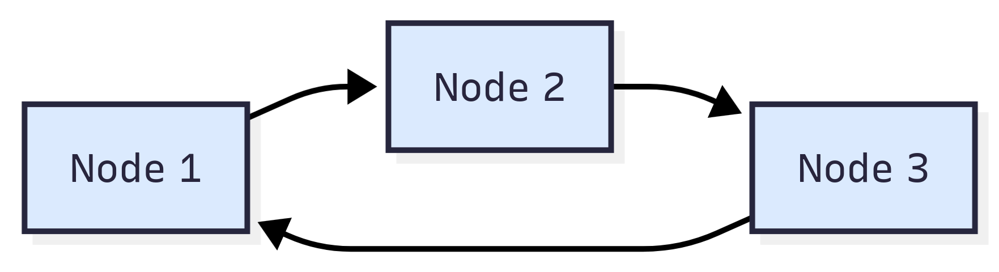
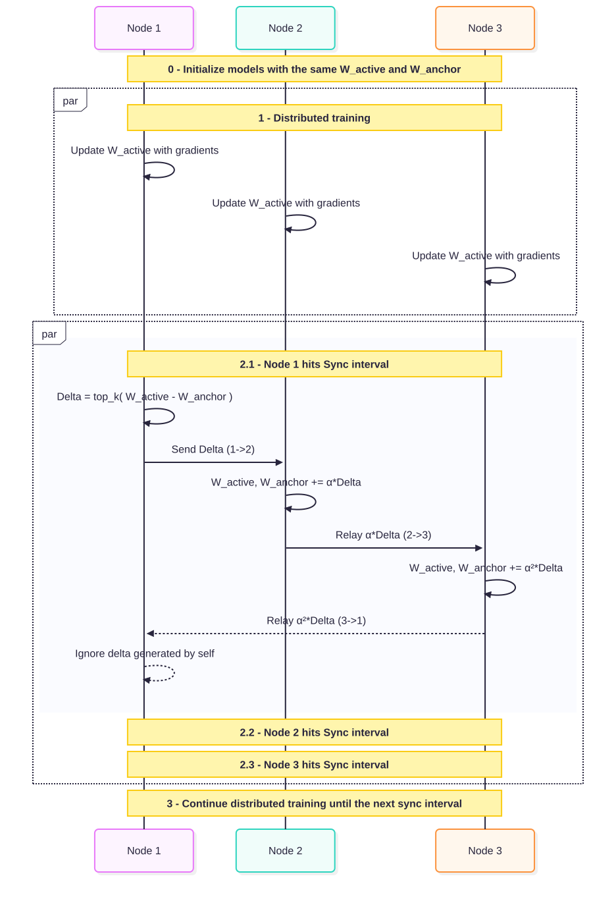

# DeltaFabric

A decentralized weight synchronization protocol for distributed ML training with built-in networking. Currently supporting PyTorch and Burn.

## Core Concepts

### No-Master Architecture

Eliminates master-server bottlenecks by letting every node participate equally in synchronization. It also makes life easier by cutting out the need to set up or manage a central server.

### Built-in Networking and Automatic Peer Discovery

We include a built-in networking layer powered by the `Zenoh` P2P protocol. Nodes discover peers and exchange deltas automatically without external coordination.

### Anchor-Active Weight Model

We maintain two weight buffers per node:

- **W_active**: weights currently being optimized by local gradients
- **W_anchor**: weights representing the last acknowledged state

The delta between these buffers captures the local updates discovered since the last synchronization round. This two-buffer design eliminates the need to store copies of every peer's model, reducing memory overhead compared to traditional decentralized approaches.

### Compressed Delta

Sending an entire set of weights becomes impractically large as the model grows. To reduce bandwidth and increase speed, we only send the most significant changes (deltas) per step. This allows a single packet to hold not only one delta but also others relayed from additional peers.

## Example Setup

The ring topology below represents a minimal DeltaFabric cluster where each node connects to only one peer:

  

This sequence diagram illustrates the weight delta synchronization process for the ring topology. All nodes start with identical weight buffers and train locally in parallel. When a node hits its sync interval, it computes a compressed delta and sends it to its single peer. Each peer applies the attenuated delta to its own weights and relays it forward until it circulates back to the originator or the delta gets too small (< relay_threshold).

  

